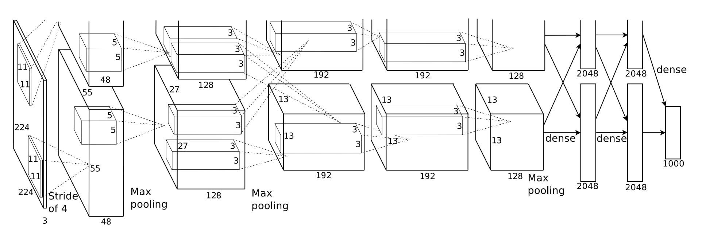

# AlexNet Implementation (Krizhevsky et al., 2012)

This project is an implementation of the landmark **AlexNet** model from the paper:

**"ImageNet Classification with Deep Convolutional Neural Networks"**

AlexNet is one of the most influential convolutional neural network architectures, winning the **ILSVRC 2012** competition by a large margin and kickstarting the modern deep learning revolution. In the original work, the model was trained on the large-scale **ImageNet** dataset consisting of 1.2 million images across 1000 classes.

## Overview

The architecture of the original model is shown below:



*Figure: Original AlexNet architecture from Krizhevsky et al., “ImageNet Classification with Deep Convolutional Neural Networks”, 2012.*

The original AlexNet used several data augmentation and regularization strategies to improve performance on ImageNet.  
In this implementation, the same techniques were reproduced and evaluated independently.  
All experiments were compared using **only the cross-validation split** to ensure consistent evaluation.

All the experiments were done on Google Colab's T4 GPU. Each Model takes around 3 hours to train. 


## Model Variants Used in Experiments

1. **Baseline Model**
   This is the standard AlexNet implementation trained on TinyImageNet without any additional regularization or augmentation beyond basic resizing and normalization.

2. **RandomCrop Model**
   This model follows the same architecture but applies `RandomCrop` to introduce spatial variability during training.

3. **Pixel Augmentation Model**
   This model uses the same architecture but includes pixel-level augmentations such as color jitter, brightness/contrast adjustments, and random noise injection to improve robustness.

4. **Dropout Model**
   This model keeps the same architecture but introduces dropout layers in the fully connected blocks to reduce overfitting and improve generalization.

5. **Batch Normalization Model**
   This model modifies the architecture by inserting BatchNorm layers after convolutional blocks, stabilizing gradients and speeding up convergence.

6. **Combined Enhancements Model-Large**
   This model integrates all improvements — Random Crop, Pixel Augmentation, Dropout, and Batch Normalization — into a single architecture to maximize regularization and performance.
7. **Combined Enhancements Model-Small**
   Similar as Combined model, but last 3 Fully Connected layers are removed and replaced with 2 fully connected networks of size 2000 and 200
8. **Combined Model with GAP**
   Last Layers are removed and replaced with adaptive average pooling immediately after 5th convolution layer. A Fully Connected Layer of 200 neurons are at the last layer.


## Dataset

The original AlexNet was trained on the full ImageNet dataset of 1.2M images.
This implementation uses **TinyImageNet**, consisting of:

* **100,000 training images**
* **10,000 validation images**
* **200 classes**
* Images resized to: **64 × 64**

This makes experimentation practical on Google Colab.

## Performance

The original paper achieved **top-1 accuracy of 62.5%** and **top-5 accuracy of 84.7%** on ImageNet.

This implementation, trained on TinyImageNet with fewer epochs, achieves:

* **Top-1 Accuracy:** *[fill your number]*
* **Top-5 Accuracy:** *[optional]*

Performance will vary depending on training epochs, augmentations, and normalization layers used.

## Model Variants Comparison

### Training Setup
Each Model was train upto 30 epochs and every epoch started showing signs of overfitting almost around 8-12 epochs. 
### Results
The following table summarizes the performance of different AlexNet variants evaluated on the cross-validation split.

| Model         | Train Error (Best) | Val Error | Epoch of Best Perf. | Increase from Baseline|
|--------------|---------------------|-----------|-----------------------|------|
| **Baseline**      | 2.1828              | 30.32%    | 9 Epochs              |—|
| **Spatial Crop**  | 1.8864              | 35.49%    | 13 Epochs             |5.71%|
| **Pixel Aug.**    |2.6792 | 33.31%         | 11 Epochs                    |2.99%|
| **Dropout**       | 2.5459              | 33.57%    | 11 Epochs             |3.25%|
| **BatchNorm**     | 1.8411              | 31.40%    | 6 Epochs              |1.08%|
|**Alexnet-Big**|-|-|-|-|
|**Alexnet-Small**|1.2574|44.09%|16 Epochs|14.23%

The increase in accuracy here is found higher than the original paper. This might be accounted due to higher overfitting in implementation due to a smaller dataset being used. Therefore the effects are more visible due to regularizations.

## Observations
The model trained here is huge, it has almost 60M parameters, of which majority of it comes from the fully connected layers. 

The original Model was used to train 1.2M images, where as this was used to train only 100k images, due to which each model overfitted quite quickly.

BatchNorm had the fastest training speed, it completed before 2 hours, where as pixel augmentation was slowest. 

RandomCrop adds a better regularization effect than dropout. It might be due to the dropout rate being to low for such a large network with small data.


## Installation

```bash
git clone https://github.com/Vidit-01/alexnet-implementation.git
cd alexnet-implementation
pip install -r requirements.txt
```

## Usage

You can train any AlexNet variant by specifying the model file and the transform file.

### Basic Training Command

```bash
python train.py models/alexnet_baseline.py
```

This will:

* Load the baseline model
* Use default training transforms (`utils/transforms_baseline.py`)
* Train for 30 epochs
* Save the best model to `results/best.pth`

---

### Training with HyperParameters

```bash
python train.py models/alexnet_variant.py --transforms utils/transforms_randomcrop.py
```

---

### Custom Hyperparameters

```bash
python train.py models/alexnet_bn.py \
    --epochs 30 \
    --bs 128 \
    --lr 0.01 \
    --momentum 0.9 \
    --wd 0.0005
```

---

### Output Directory

```bash
python train.py models/alexnet_dropout.py --out results_dropout/
```

---

### Device Selection

Use CPU or GPU manually:

```bash
python train.py models/alexnet_combined.py --device cuda
python train.py models/alexnet_combined.py --device cpu
```

---

### Arguments Summary

| Argument        | Description                                            | Default                        |
| --------------- | ------------------------------------------------------ | ------------------------------ |
| `model_path`    | Path to the `.py` file containing the model definition | **Required**                   |
| `--epochs`      | Number of training epochs                              | `30`                           |
| `--bs`          | Batch size                                             | `64`                           |
| `--lr`          | Learning rate                                          | `0.01`                         |
| `--momentum`    | SGD momentum                                           | `0.9`                          |
| `--wd`          | Weight decay                                           | `0.0005`                       |
| `--num_classes` | Number of output classes                               | `200`                          |
| `--workers`     | Number of dataloader workers                           | `2`                            |
| `--out`         | Directory to save results                              | `results/`                     |
| `--device`      | `cuda`, `cpu`, or `auto`                               | `auto`                         |
| `--transforms`  | Transform file to load                                 | `utils/transforms_baseline.py` |

### Evaluation
For evaluating the saved model, you can run the following command
```bash
python evaluate.py models/alexnet_baseline.py results/best.pth
```

## Further Improvements
It can be concluded that the model specially the Fully Connected Layers are too large for small dataset. Hence I would try to reduce the size of fully connected layers and train the best model again
## Citation

If you use or reference this implementation, please cite the original work:

> Alex Krizhevsky, Ilya Sutskever, Geoffrey E. Hinton.
> *ImageNet Classification with Deep Convolutional Neural Networks.*
> NIPS 2012.
> [PDF Link](https://papers.nips.cc/paper/2012/hash/c399862d3b9d6b76c8436e924a68c45b-Abstract.html)
